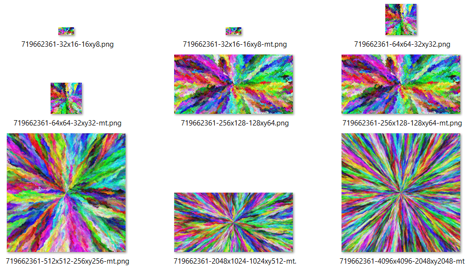

# omnichroma

## What
https://codegolf.stackexchange.com/questions/22144/images-with-all-colors

My C++ implementation of fejesjoco's algorithm.

`main.cpp` generates all 6 image sizes, single thread and multithread (thread pool). Sample output (with `CoordSet = std::unordered_set<Coord>` (msvc)):



 

 

 

Left are generated single-threaded-ly, right are generated multithreaded-ly (they are similar)

Bigger images (512x512 \~ 621 KB, 2048x1024 \~ 5047 KB, 4096x4096 \~ 37562 KB) are in `img` folder.

```
Seed = 719662361
Num threads = 16
32x16 single thread: repeat 100 times, total = 0.150843s, avg = 0.00150843s
32x16 threadpool   : repeat 100 times, total = 0.9971447s, avg = 0.009971447s
64x64 single thread: repeat 10 times, total = 0.5214949s, avg = 0.05214949s
64x64 threadpool   : repeat 10 times, total = 1.2743839s, avg = 0.12743838999999998s
256x128 single thread: repeat 1 time, total = 0.8621473s, avg = 0.8621473s
256x128 threadpool   : repeat 1 time, total = 1.346049s, avg = 1.346049s
512x512 single thread: repeat 1 time, total = 26.5719913s, avg = 26.5719913s
512x512 threadpool   : repeat 1 time, total = 13.577951s, avg = 13.577951s
2048x1024 single thread: repeat 1 time, total = 482.6002738s, avg = 482.6002738s
2048x1024 threadpool   : repeat 1 time, total = 172.1309171s, avg = 172.1309171s
4096x4096 threadpool   : repeat 1 time, total = 4140.7884682s, avg = 4140.7884682s
```

(my CPU is Ryzen 7 4800H)

## What's new
- v0.0.2: Produce reproducable images from `seed` (and starting point). Tested on Windows (msvc and msys2) and Linux (Ubuntu).
  - Use a shuffle function from cppreference (`cppref_shuffle`) to generate random colors.
  - Use identity function instead of `std::hash<int>{}()`. GCC uses identity function for hashing `int` while MSVC uses  hash.
  - Use `CoordSet = boost::unordered_set<Coord, std::hash<Coord>>`. MSVC/GCC have different `std::unordered_set` implementation. Using `boost::unordere_set` makes `generate()` runs about 30% slower than `std::unordere_set`. I also tried various `tsl` hash sets but nothing beats `std::unordere_set`.

## How to configure with CMake

### Linux
From bash terminal:
```
cmake --preset ninjam-linux
```

### Windows
Available presets:

- `vs2022`

  From powershell terminal:
  ```powershell
  cmake --preset vs2022
  ```
  You should use VS Community 2022 and this preset on Windows.

- `vs2022-32`

  From powershell terminal:
  ```powershell
  cmake --preset vs2022-32
  ```

- `ninjam-msvc`

  From powershell terminal:
  ```powershell
  cmd
  "C:\Program Files\Microsoft Visual Studio\2022\Community\VC\Auxiliary\Build\vcvars64.bat"
  cmake --preset ninjam-msvc
  ```
  Please correct the path to `vcvars64.bat` or `vcvars32.bat`

- `ninjam-msys2`

  From MSYS2 MinGW 64-bit terminal:
  ```
  cmake --preset ninjam-msys2
  ```
  You need to configure in MSYS2 MinGW terminal to make sure you use the correct MinGW's `cmake`

- `ninjam-msys2-novcpkg`

  Do the same with `ninjam-msys2` except change the name of the preset.

## How to debug with VS Code

You only need Microsoft C/C++ extension (cpptools).

- Intenllisense profiles are stored in `.vscode/c_cpp_properties.json`
- Build commands are store in `.vscode/tasks.json`
- Debug profiles are stored in `.vscode/launch.json`
- Open `.vscode/<project name>.code-workspace` with VS Code

### Linux

- For `ninjam-linux`: it works out of the box, nothing to do.

### Windows

- For `ninjam-msys2` amd `ninjam-msys2-novcpkg`: you need to set `MINGW_ROOT` environment var to `/mingw64` folder (or `/mingw32`, etc.). For example `D:\msys64\mingw64`

- For `ninjam-msvc`: you need to open VS Code with `vcvars64.bat` (or `vcvars32.bat`) enabled. For example from powershell terminal run:

  ```
  cmd
  "C:\Program Files\Microsoft Visual Studio\2022\Community\VC\Auxiliary\Build\vcvars64.bat"
  code .vscode/omnichroma.code-workspace
  ```

## How to use external libraries

- For `ninjam-msys2-novcpkg`:
  - Open MSYS2 shell, install needed libraries with `pacman -S ...`
  - Add `find_package(...)` and `target_link_libraries(...)` to `CMakeList.txt`

- For other presets that use `vcpkg`:
  - Add the library's names to `vcpkg.json` `"dependencies": [ ... ]"`
  - Run `cmake --preset ...` again. `vcpkg` will build and installed those libraries for you. In addition to that, `vcpkg` will tell you how to find and link those libraries with CMake.
  - Add `find_package(...)` and `target_link_libraries(...)` to `CMakeList.txt`
